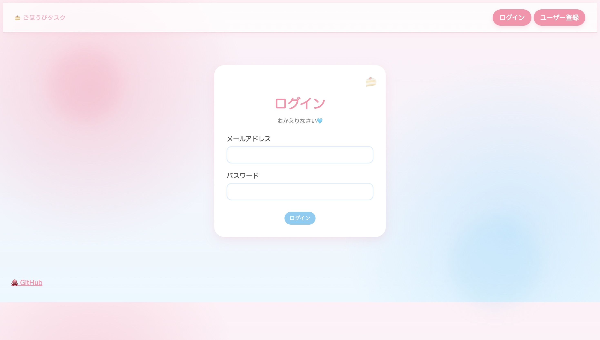
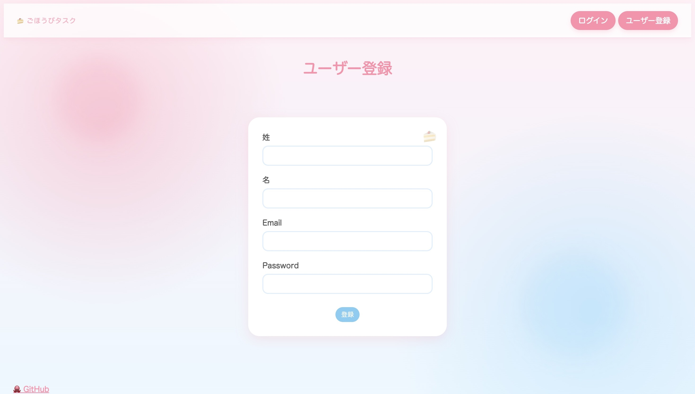

# RewardMe 🍰

ごほうびでタスクを続けるシンプルなToDoアプリです。

## URL
https://reward-task-app.onrender.com/

## GitHub
https://github.com/mize1978/reward_task_app

## 機能
- ユーザー登録 / ログイン / ログアウト
- ユーザーごとのタスク管理
- タスク作成
- タスク一覧表示
- タスク完了 / 未完了切り替え
- タスク削除
- 今日のがんばり数表示
- 連続がんばり日数表示
- カレンダーで達成日を表示

## 技術
- Ruby on Rails
- PostgreSQL
- Render

## こだわり
タスクを「やること」ではなく「ごほうび」として扱い、
楽しく継続できる体験を意識しました。
ピンクを基調にしたやわらかく可愛い配色、丸みのあるカード、
ふわっとした影やアニメーションを取り入れ、
「がんばった自分をほめる」世界観をUIで表現しています。

## スクリーンショット

### ログイン画面

### ユーザー画面

### タスク一覧（一覧画面）

### カレンダー表示



