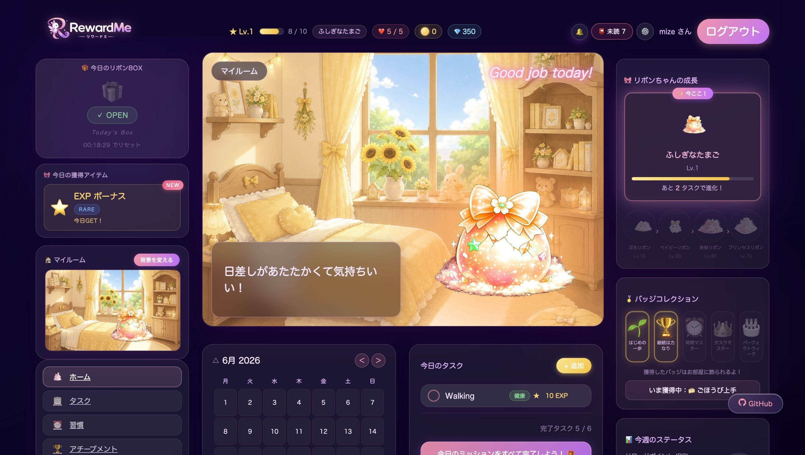
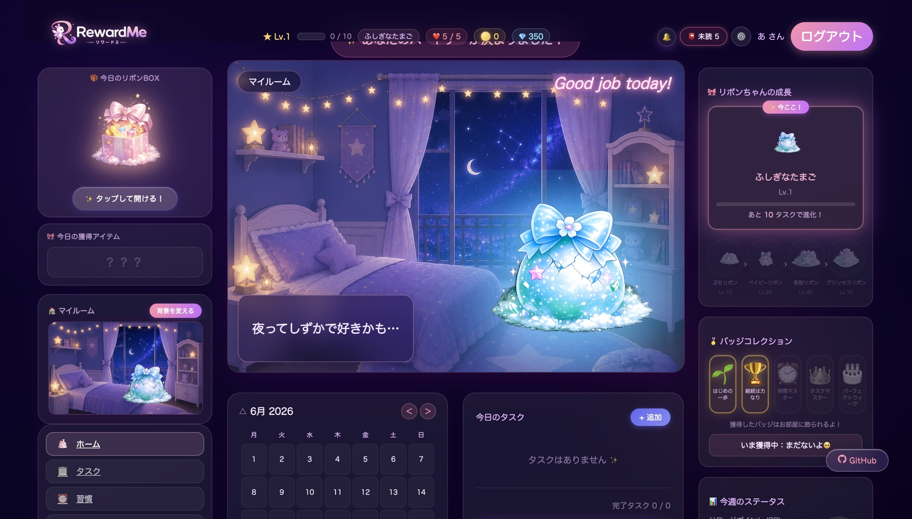

<div align="center">
  
  <br><br>
  
  <br><br>
  <h3>リボンちゃんと暮らす、ごほうびタスク管理アプリ</h3>
  <br>
  
  &nbsp;
  
</div>

---

**「タスク管理は続けることが一番難しい」** という課題を、「育成」「コレクション」「マイルーム」というゲーム体験で解決することを目指して開発しました。

**GitHub**：https://github.com/mize1978/mize_tasks

---

## 目次

- [機能一覧](#機能一覧)
- [技術スタック](#技術スタック)
- [技術的なこだわり](#技術的なこだわり)
- [画面構成](#画面構成)
- [セットアップ](#セットアップ)
- [データベース設計](#データベース設計)
- [今後の実装予定](#今後の実装予定)

---

## 機能一覧

### タスク管理
- タスクの作成 / 編集 / 削除 / 完了
- 期日設定 ＋ カレンダーで達成日を可視化（simple_calendar）
- 期限切れ・当日期限のリマインダー通知（ヘッダードロップダウン）

### ゲーミフィケーション
- タスク完了でコイン・EXP を獲得
- 経験値バーによるレベル表示（ヘッダー常時表示）
- ライフシステム（5 ライフ / 期限切れタスクで消費）

### キャラクター育成（リボンちゃん）
- 完了タスク数に応じた 5 段階の進化（たまご → プリンセスリボン）
- 卵の色を 3 種類から選択（ピンク・青・黄色）
- 部屋や卵色の組み合わせで変化するセリフシステム
- 進化直前の専用アニメーション

### マイルーム
- 12 種類の背景テーマ（FREE / NORMAL / RARE / SUPER / EVENT）
- コインで新しい部屋を解放
- 卵の色と部屋テーマによる「おすすめコンボ」セリフ
- 部屋テーマに連動して UI 全体のアクセントカラーが変化

### デイリー BOX
- 毎日 1 回開封可能なランダム報酬ガチャ
- コイン / EXP ボーナス（レアリティ別重み付き抽選）

### お手紙（インゲームメール）
- リボンちゃんや運営からの手紙が届くシステム（14 通）
- トリガー：初回ログイン / 卵選択 / タスク達成 / レベル到達（Lv10・20・40）/ 部屋変更
- 未読数をヘッダーにゲームっぽく表示（📮 未読 N）

---

## 技術スタック

| カテゴリ | 技術 |
|---------|------|
| バックエンド | Ruby on Rails 7.0 |
| フロントエンド | Stimulus JS / importmap / Hotwire（Turbo） |
| スタイリング | CSS（カスタムプロパティ / アニメーション）/ SCSS |
| データベース | MySQL（開発）/ PostgreSQL（本番） |
| 認証 | bcrypt（has_secure_password） |
| デプロイ | Render |
| その他 | simple_calendar / sprockets |

---

## 技術的なこだわり

### ■ CSS カスタムプロパティによる動的テーマ

**課題**：部屋テーマが12種類あり、それぞれでボタン・EXPバー・カレンダー・進捗リングなどの色が変わる必要がある。

**却下した方法**：`.theme-star .tasks-add-btn { ... }` のようなクラスベースのスタイルを書く場合、UI要素が増えるたびに全テーマ分のCSSを追加しなければならない。12テーマ × 複数要素で記述量が爆発的に増え、テーマ追加のたびに既存CSSを触る必要が生じる。

**採用した方法**：`body[data-room-theme]` にCSS変数を定義し、各UIは `var(--accent-1)` を参照するだけにした。新しい部屋を追加するときは変数の定義を1ブロック追加するだけでよく、既存CSSは一切変更しない。

<details>
<summary>▼ 詳細コード</summary>

```css
body[data-room-theme="star"] {
  --accent-1:    #818cf8;
  --accent-2:    #a78bfa;
  --accent-glow: rgba(129, 140, 248, 0.5);
}

/* テーマを意識した要素はすべて変数を参照するだけ */
.tasks-add-btn {
  background: linear-gradient(135deg, var(--accent-1), var(--accent-2));
  box-shadow: 0 4px 20px var(--accent-glow);
}
```

</details>

---

### ■ 1 枚の画像から 3 色を生成する CSS フィルター

**課題**：卵・キャラクターを3色（ピンク・青・黄色）に対応させる必要がある。キャラクターは進化で5段階あるため、単純に色違い画像を用意すると 5ステージ × 3色 = **15枚**になる。色を1種類追加するたびに全ステージ分の画像作成が発生し、スケールしない。

**却下した方法**：色ごとに画像を用意する方法は、現時点では対応できても進化ステージや卵色が増えるたびに画像管理コストが線形に増加する。デザイン修正の際も全色分の画像を更新しなければならないため採用しなかった。

**採用した方法**：CSS の `hue-rotate()` フィルターで1枚の画像から色を変換する。追加コスト0で何色でも対応できる。ただし `hue-rotate` は角度の指定を間違えると意図しない色になるため、元画像の主色（ピンク / 色相330°）から目標色の色相を逆算してフィルター値を導いた。

<details>
<summary>▼ 詳細コード</summary>

```
ピンク（330°）+ hue-rotate(260°) = 230°（青）
ピンク（330°）+ hue-rotate( 80°) =  50°（黄色）
```

```ruby
EGG_COLOR_FILTERS = {
  "pink"   => "",
  "blue"   => "hue-rotate(260deg) saturate(1.2) brightness(1.0)",
  "yellow" => "hue-rotate(80deg)  saturate(1.5) brightness(1.1)"
}.freeze
```

</details>

---

### ■ CSS アニメーションと inline スタイルの優先度競合への対応

**課題**：キャラクターに `hue-rotate` フィルターを inline スタイルで指定したが、マイルームでは常にピンクのまま変わらなかった。キャラクター画像には `@keyframes` によるグロウアニメーションが付いており、CSS の仕様上 `@keyframes` は inline スタイルを含む他のすべての指定より優先されるため、hue-rotate が上書きされていた。

**却下した方法**：`!important` で filter を強制適用する方法も試みたが、`@keyframes` 内のスタイルには `!important` も効かない。また仮に効いたとしても、アニメーション中にフィルターが競合して意図しない描画になるため採用しなかった。

**採用した方法**：CSS のレンダリングモデルでは**親要素のフィルターは子の合成済み出力全体に後から適用される**。この仕様を利用し、hue-rotate をアニメーションのない親要素に移動した。アニメーション（グロウ効果）と色変換が干渉せず共存できる。

<details>
<summary>▼ 詳細コード</summary>

```erb
<%# NG: img に直接指定するとアニメーションに上書きされる %>
">

<%# OK: 親 div に移動することで競合を回避 %>
<div class="room-chara-shake" style="<%= ribbon_color_style %>">
    <%# ← アニメーションはここ %>
</div>
```

</details>

---

### ■ Stimulus JS による部屋 × 卵色のセリフシステム

**却下した方法**：セリフをDBに保存してAPIで取得する方法も検討したが、キャラクターがしゃべるたびにリクエストが発生し、体験上の「間」が生まれてしまう。また、セリフは頻繁に変わるゲームデータではなく、コードと一緒に管理すべきコンテンツだと判断した。

**採用した方法**：セリフ・組み合わせ判定・抽選ロジックをすべて Stimulus コントローラー内の JS 定数として完結させた。ページロード後はサーバー通信なしで即時動作し、部屋や卵色を変えても一切の遅延がない。

<details>
<summary>▼ 発動ロジック</summary>

```
優先度：
  ① 5%  → レアリアクション（8 パターン）
  ② 30% → おすすめコンボセリフ（部屋 × 卵色 / 13 パターン）
  ③ 残り → 部屋別セリフ（12 部屋 × 各 4〜5 パターン）
```

</details>

---

### ■ DB テーブルを増やさない手紙システム

**却下した方法**：`letters` テーブルを作り、手紙をDBレコードとして管理する方法。管理画面から編集できる利点はあるが、手紙の内容は仕様と一体のコンテンツであり、DBに分離すると「コードと内容が別の場所に存在する」状態になる。また、テーブル設計・マイグレーション・シードデータの管理コストが発生する。

**採用した方法**：手紙本文は Ruby 定数として `letter.rb` に集約し、コードと一緒にバージョン管理する。DBには「どの手紙を読んだか」という状態のみを JSON カラム1列で保持する。手紙を追加・変更する際のマイグレーションが不要で、コードレビューで内容の変更履歴も追える。

<details>
<summary>▼ 詳細コード</summary>

```ruby
# 手紙の内容は Ruby 定数（DB テーブル不要）
CATALOG = [
  { id: "level_10", from: "リボンちゃん", trigger: :level_10, body: "..." },
  { id: "room_letter_star", trigger: :room_star, body: "..." },
]

# 既読 ID だけ DB に保存
# users.read_letter_ids :json → ["welcome", "level_10"]
```

</details>

---

### ■ 外部 gem を使わないゲームシステム

**設計の核心**：EXP・レベル・進化ステージなどを全て `completed_count`（累計完了タスク数）の1カラムから動的に算出する設計を選んだ。

**却下した方法**：`exp`・`level`・`stage` を個別カラムとして持ち、タスク完了のたびに更新する方法。一見シンプルだが、ゲームバランスを調整するたびにデータの再計算やマイグレーションが必要になる。また、カラム間の整合性が崩れるバグが起きやすい。

**採用した方法**：`completed_count` を唯一の「ソース・オブ・トゥルース」とし、EXP・レベル・ステージはすべてメソッドで計算する。バランス調整はコードを変更するだけで全ユーザーに即時反映され、DB更新は不要。状態の不整合が構造上発生しない。

<details>
<summary>▼ 設計概要</summary>

- **EXP・レベル**：`completed_count` から全ステータスを動的に計算
- **進化ステージ**：5 段階、各ステージで画像・名前・セリフが変化
- **デイリー BOX**：`weight` 値による重み付き抽選を自前で実装
- **ライフシステム**：期限切れタスクで消費、一定期間経過で自動回復

</details>

---

## 画面構成

```
/ ...................... ランディングページ
├── /signup ............. ユーザー登録
├── /login .............. ログイン
├── /choose_egg ......... パートナー選択（初回のみ）
├── /dashboard .......... マイルーム（メイン画面）
├── /my_tasks ........... タスク一覧
├── /tasks/new .......... タスク作成
├── /shop ............... 部屋ショップ
├── /letters ............ お手紙一覧
├── /letters/:id ........ お手紙詳細
└── /settings ........... 設定
```

---

## スクリーンショット

<!-- デモ URL は後日追記 -->

<div align="center">
  
  &nbsp;
  
  <br><br>
  
</div>

---

## セットアップ

```bash
git clone https://github.com/mize1978/mize_tasks.git
cd reward_task_app

bundle install

# データベース設定
cp config/database.yml.example config/database.yml
# database.yml を編集してください

bin/rails db:create db:migrate

bin/rails server
# → http://localhost:3000
```

---

## データベース設計

### users テーブル（主要カラム）

| カラム | 型 | 説明 |
|-------|----|------|
| nickname | string | 表示名 |
| email | string | ログイン用 |
| password_digest | string | bcrypt ハッシュ |
| coins | integer | 所持コイン |
| lives | integer | ライフ（最大 5） |
| completed_count | integer | 累計完了タスク数（EXP の基準値） |
| egg_color | string | pink / blue / yellow |
| current_room_bg | string | 現在の部屋 ID |
| read_letter_ids | json | 既読手紙 ID の配列 |
| last_box_opened_at | datetime | BOX 最終開封日時 |

### tasks テーブル（主要カラム）

| カラム | 型 | 説明 |
|-------|----|------|
| title | string | タスク名 |
| date | date | 期日 |
| done | boolean | 完了フラグ |
| coin_reward | integer | 完了時に得るコイン |
| user_id | integer | 外部キー |

---

## 今後の実装予定

- 家具システム（部屋に好きな家具を配置）
- イベント背景・季節限定のお手紙
- パートナー衣装のカスタマイズ
- マイルームの細かいカスタマイズ機能
- フレンド・ランキング機能

---

*個人開発 / Ruby on Rails 7*
