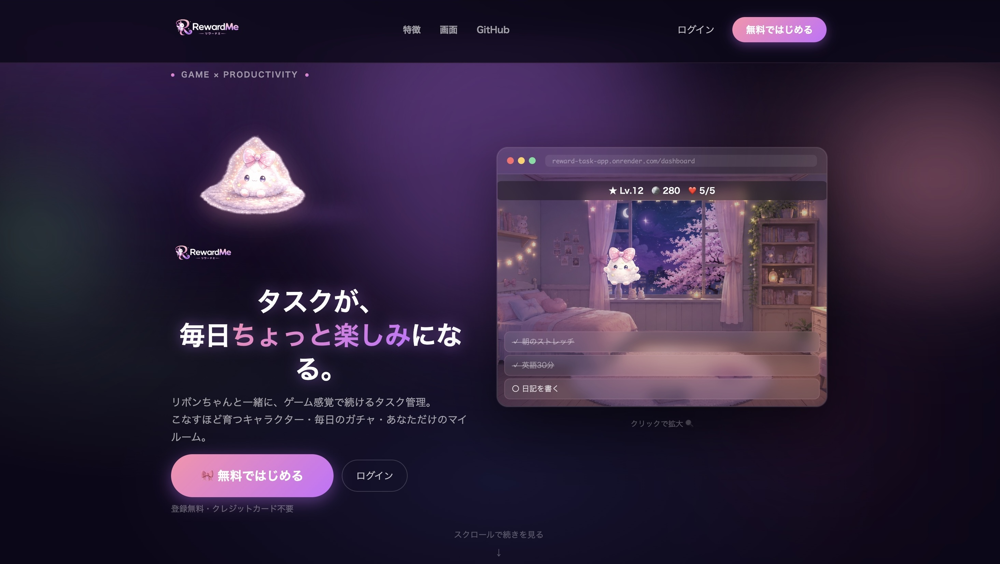
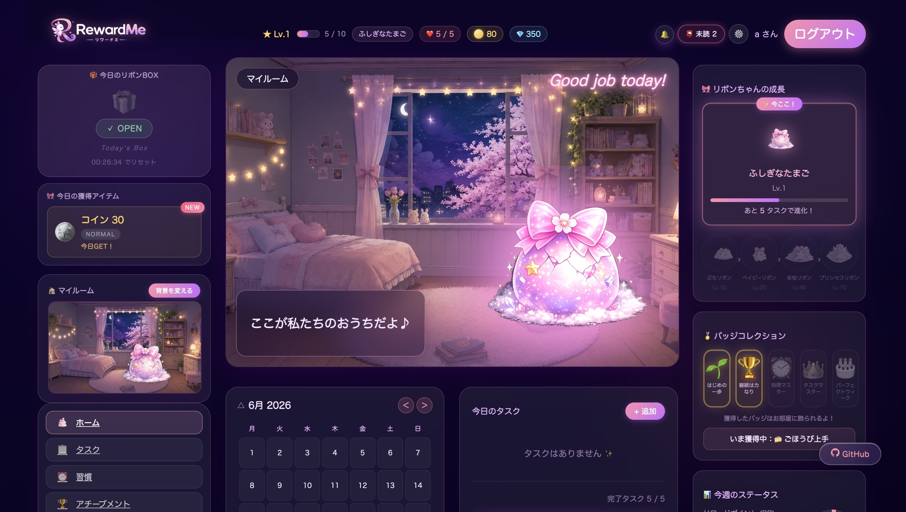
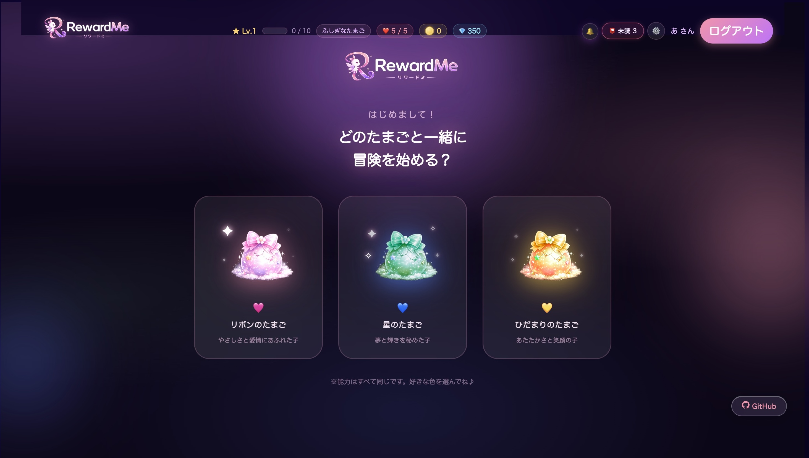
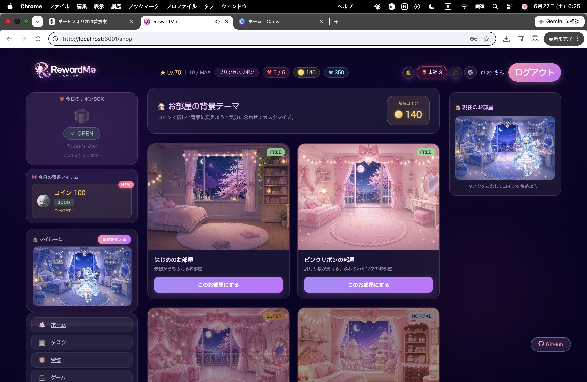
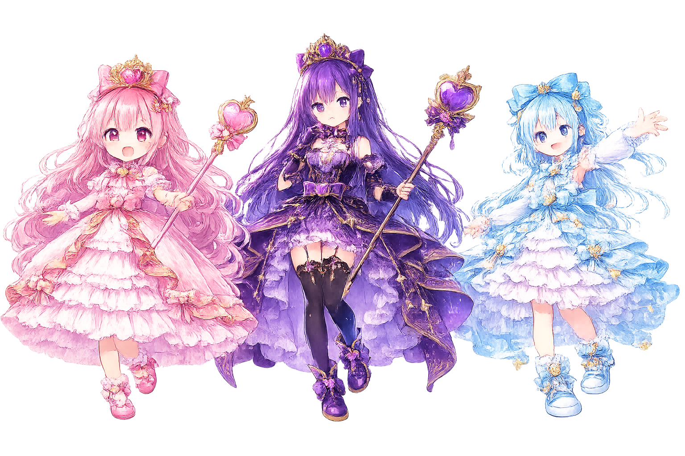

<div align="center">
  
  <br><br>
  <strong>リボンちゃんと暮らす、ごほうびタスク管理アプリ</strong>
  <br><br>

  
  
  
  

  <br>

  🔗 **[デモを見る](https://reward-task-app.onrender.com)**　|　📖 **[GitHubリポジトリ](https://github.com/mize1978)**

  <br>

  
</div>

---

## 概要

「タスク管理は続けることが一番難しい」という課題を、**育成・コレクション・マイルーム**というゲーム体験で解決するWebアプリです。

タスクをこなすたびにリボンちゃんが進化し、コインが貯まりガチャが引ける。毎日アプリを開く理由を、ゲームの仕組みで自然に作ります。

---

## スクリーンショット

<div align="center">
  
  <br><br>
  
  <br><br>
  
  <br><br>
  
</div>

---

## 機能一覧

### タスク管理
- タスクの作成 / 編集 / 削除 / 完了
- カテゴリ・優先度・期日の設定
- 7日間の達成カレンダー（曜日ドット表示）
- 連続記録ストリーク（🔥）
- 期限切れ・当日期限のリマインダー（ヘッダードロップダウン）

### ゲーミフィケーション
- タスク完了で **コイン・EXP** を獲得
- 経験値バーによるレベル表示（ヘッダー常時表示）
- ライフシステム（最大5ライフ / 期限切れで消費・時間経過で回復）
- バッジコレクション（達成条件ごとに解放）

### キャラクター育成（リボンちゃん）
- **ピンク・パープル・ブルー** の3色から選択
- 累計完了タスク数に応じた **4段階の進化**（たまご → プリンセスリボン）
- 進化直前の専用シェイクアニメーション
- 部屋・キャラ色の組み合わせによるセリフシステム（36パターン以上）

### マイルーム
- **18種類** の部屋背景テーマ（FREE / NORMAL / RARE / SUPER / EVENT）
- コインで新しい部屋を解放
- 部屋テーマに連動してUI全体のアクセントカラーが変化

### ガチャ
- コインで1回・10連ガチャ
- レアリティ別（COMMON / RARE / SUPER / ULTRA）重み付き抽選
- 獲得称号（gacha_title）をプロフィールに反映

### リボンキャッチゲーム
- 30秒で落ちてくるリボンをタップしてキャッチ
- ハイスコア記録・デイリープレイ管理

### デイリーBOX
- 毎日1回開封できるランダム報酬
- コイン / EXPボーナス（レアリティ別抽選）

### お手紙（インゲームメール）
- リボンちゃんや運営から届くゲーム内メール（14通）
- トリガー：初回ログイン / 卵選択 / レベル到達（Lv10・20・40）/ 部屋変更

---

## 技術スタック

| カテゴリ | 技術・ツール |
|---------|------------|
| バックエンド | Ruby on Rails 7.0 |
| フロントエンド | Stimulus JS / importmap / Hotwire (Turbo) |
| スタイリング | CSS（カスタムプロパティ / アニメーション）/ SCSS |
| データベース | MySQL（開発）/ PostgreSQL（本番） |
| 認証 | bcrypt（has_secure_password） |
| デプロイ | Render |
| その他ライブラリ | simple_calendar / sprockets |

---

## 技術的なこだわり

### ■ CSSカスタムプロパティによる動的テーマ切り替え

**課題**：18種類の部屋テーマで、ボタン・EXPバー・リングなど全UIの色が変わる必要がある。

**却下した方法**：`.theme-star .tasks-add-btn { ... }` のようなクラスベースのスタイルを書く方法。18テーマ × 複数UI要素で記述量が爆発し、テーマ追加のたびに既存CSSを修正しなければならない。

**採用した方法**：`body[data-room-theme]` にCSS変数を定義し、各UIは `var(--accent-1)` を参照するだけにした。新しい部屋を追加するときは変数ブロックを1つ追加するだけで、既存CSSは一切変更不要。

<details>
<summary>▼ 詳細コード</summary>

```css
body[data-room-theme="star"] {
  --accent-1:    #818cf8;
  --accent-2:    #a78bfa;
  --accent-glow: rgba(129, 140, 248, 0.5);
}

/* 全UIはCSS変数を参照するだけ */
.tasks-add-btn {
  background: linear-gradient(135deg, var(--accent-1), var(--accent-2));
  box-shadow: 0 4px 20px var(--accent-glow);
}
```

</details>

---

### ■ CSSアニメーションとinlineスタイルの優先度競合への対応

**課題**：キャラクターに色フィルターをinlineスタイルで指定したが、マイルームでは `@keyframes` グロウアニメーションが `filter` プロパティを制御しているため、色変換が反映されなかった。

**却下した方法**：同じ要素に別の方法でフィルターを指定することも検討したが、アニメーションがプロパティを制御している間は競合して意図しない描画になる。

**採用した方法**：CSSのレンダリングモデルでは**親要素のフィルターは子の合成済み出力全体に後から適用される**。この仕様を利用し、色フィルターをアニメーションのない親要素に移動した。アニメーションと色変換が干渉せず共存できる。

<details>
<summary>▼ 詳細コード</summary>

```erb
<%# NG: img に直接指定するとアニメーションに上書きされる %>
">

<%# OK: 親 div に移動することで競合を回避 %>
<div class="room-chara-shake" style="<%= ribbon_color_style %>">
    <%# ← アニメーションはここ %>
</div>
```

</details>

---

### ■ Stimulus JS による部屋 × キャラ色のセリフシステム

**課題**：部屋（18種類）× キャラ色（3色）の組み合わせに応じてセリフを出し分ける必要がある。組み合わせは54パターン以上で、さらにレアリアクションやコンボ判定も含まれる。

**却下した方法**：セリフをDBに保存してAPIで取得する方法。キャラがしゃべるたびにリクエストが発生し、体験上の「間」が生まれる。セリフはコードと一緒に管理すべきコンテンツと判断した。

**採用した方法**：セリフ・組み合わせ判定・抽選ロジックをすべてStimulusコントローラー内のJS定数として完結させた。ページロード後はサーバー通信なしで即時動作する。

<details>
<summary>▼ 抽選優先度</summary>

```
① 5%  → レアリアクション（8パターン）
② 30% → おすすめコンボセリフ（部屋 × キャラ色 / 13パターン）
③ 残り → 部屋別セリフ（各部屋 4〜5パターン）
```

</details>

---

### ■ DBテーブルを増やさない手紙システム

**課題**：レベル到達・部屋変更など複数トリガーに応じて手紙を届けるシステムが必要。手紙の内容は今後も追加・変更される前提で、管理コストを最小限に抑えたい。

**却下した方法**：`letters` テーブルを作りDBレコードとして管理する方法。手紙はコードと一体のコンテンツなので、DBに分離するとマイグレーション・シードデータの管理コストが増える。

**採用した方法**：手紙本文はRuby定数として `letter.rb` に集約し、コードと一緒にバージョン管理する。DBには「どの手紙を読んだか」という状態のみをJSONカラム1列で保持する。

<details>
<summary>▼ 詳細コード</summary>

```ruby
# 手紙の内容は Ruby 定数（DBテーブル不要）
CATALOG = [
  { id: "level_10", from: "リボンちゃん", trigger: :level_10, body: "..." },
  { id: "room_letter_star", trigger: :room_star, body: "..." },
]

# 既読 ID だけ DB に保存
# users.read_letter_ids :json → ["welcome", "level_10"]
```

</details>

---

### ■ `completed_count` をソース・オブ・トゥルースとするゲームシステム

**課題**：レベル・EXP・進化ステージ・抽選など複数のゲームシステムをどう管理するか。バランス調整のたびにDB操作が不要な設計にしたい。

**却下した方法**：`exp`・`level`・`stage` を個別カラムとして持ち、タスク完了のたびに更新する方法。バランス調整のたびに全ユーザーのデータ再計算・マイグレーションが必要になり、カラム間の不整合が起きやすい。

**採用した方法**：`completed_count` を唯一のソースとし、EXP・レベル・ステージはすべてメソッドで計算する。バランス調整はコード変更だけで全ユーザーに即時反映される。

<details>
<summary>▼ 主なメソッド</summary>

```ruby
def ribbon_stage         # completed_count から進化段階を算出
def ribbon_exp_percent   # 現ステージの進捗率（%）
def next_stage_tasks     # 次の進化まで残りタスク数
def ribbon_stage_image   # ステージ × キャラ色 に対応した画像パス
```

</details>

---

## 画面構成

```
/ ...................... ランディングページ
├── /signup ............. ユーザー登録
├── /login .............. ログイン
├── /choose_egg ......... パートナー選択（初回のみ）
├── /dashboard .......... マイルーム（メイン画面）
├── /mytasks ............ タスク一覧
├── /tasks/new .......... タスク作成
├── /games/tap .......... リボンキャッチゲーム（30秒）
├── /games/gacha ........ ガチャ
├── /shop ............... 部屋ショップ
├── /letters ............ お手紙一覧
├── /habits ............. 習慣トラッカー
├── /achievements ....... 実績・バッジ
└── /settings ........... 設定
```

---

## データベース設計

### users テーブル

| カラム | 型 | 説明 |
|-------|----|------|
| nickname | string | 表示名 |
| email | string | ログイン用メールアドレス |
| password_digest | string | bcryptハッシュ |
| coins | integer | 所持コイン |
| lives | integer | ライフ（最大5） |
| completed_count | integer | 累計完了タスク数（全ステータスの基準値） |
| egg_color | string | `pink` / `purple` / `blue` |
| current_room_bg | string | 現在の部屋ID |
| gacha_title | string | ガチャで獲得した称号 |
| tap_game_high_score | integer | リボンキャッチのハイスコア |
| tap_game_last_played_at | datetime | リボンキャッチの最終プレイ日時 |
| read_letter_ids | json | 既読手紙IDの配列 |
| last_box_opened_at | datetime | デイリーBOX最終開封日時 |
| owned_furniture | json | 所持家具IDの配列 |
| placed_furniture | json | 配置済み家具の座標データ |

### tasks テーブル

| カラム | 型 | 説明 |
|-------|----|------|
| title | string | タスク名 |
| category | string | カテゴリ（仕事 / 勉強 / 生活 etc.） |
| priority | string | 優先度（high / medium / low） |
| date | date | 期日 |
| done | boolean | 完了フラグ |
| completed_at | datetime | 完了日時 |
| coin_reward | integer | 完了時に得るコイン |
| user_id | integer | 外部キー |

---

## セットアップ

```bash
git clone https://github.com/mize1978/rewardme.git
cd rewardme

bundle install

# データベース設定
cp config/database.yml.example config/database.yml
# database.yml を編集してください

bin/rails db:create db:migrate db:seed

bin/rails server
# → http://localhost:3000
```

---

## Roadmap

| ステータス | 機能 |
|-----------|------|
| 🔜 Next | 家具の自由配置システム |
| 🔜 Next | 着せ替えシステム（衣装カスタマイズ） |
| 📋 Planned | フレンド機能 |
| 📋 Planned | ランキング |
| 📋 Planned | 季節イベント・限定お手紙 |

---

<div align="center">
  
  <br><br>
  <sub>個人開発 / Ruby on Rails 7 / 2026</sub>
  <br>
  <sub>Made with 🎀 by <a href="https://github.com/mize1978">mize1978</a></sub>
</div>
