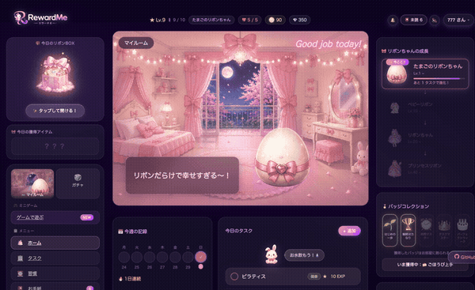

<div align="center">
  
  <br><br>

  
  
  
  
  
  
  
  

  <br>

  🔗 **[デモを見る](https://reward-task-app.onrender.com)**　|　📖 **[GitHubリポジトリ](https://github.com/mize1978)**

  <br>

  
</div>

---

## 目次

- [3行で分かる RewardMe](#3行で分かる-rewardme)
- [担当範囲](#担当範囲)
- [概要・主な機能](#概要)
- [スクリーンショット](#スクリーンショット)
- [技術スタック](#技術スタック)
- [技術的なこだわり](#技術的なこだわり)
- [一番苦労した実装](#一番苦労した実装)
- [数字で見る RewardMe](#数字で見る-rewardme)
- [データベース設計](#データベース設計)
- [画面構成](#画面構成)
- [セットアップ](#セットアップ)
- [Roadmap](#roadmap)
- [このアプリで学んだこと](#このアプリで学んだこと)
- [この制作で得られたこと](#この制作で得られたこと)
- [制作成果](#制作成果)

---

## 3行で分かる RewardMe

- **ゲーム感覚で習慣化できる**タスク管理アプリ
- リボンちゃん育成 · 18種類のマイルーム · ミニゲーム5種 · ガチャで毎日の継続を支援
- Ruby on Rails 7 + Stimulus.js でゲームロジック・UI・アニメーションをフルスクラッチ実装

---

## 担当範囲

> **企画 / UIデザイン / UX設計 / Rails実装 / Stimulus.js / CSS & アニメーション / ゲームロジック設計 / デプロイ**
>
> 全工程を一人で担当。ゲームの面白さを構成する「コイン経済・育成・抽選・ストリーク」の仕組みを、ゼロから設計・実装しました。

---

## 概要

RewardMe は、**育成ゲームの仕組みで毎日の習慣を続けられる** Web アプリです。

「タスクをこなす」のではなく「リボンちゃんを育てる」感覚で、自然に習慣が身につきます。
ガチャ・マイルーム・コイン経済圏・進化演出——ゲームが面白い理由を、そのままタスク管理に持ち込みました。

---

## 主な機能

| | 機能 | 規模 |
|---|---|---|
| 🎀 | **育成システム** — タスク完了でリボンちゃんが4段階に進化 | 3色 × 4段階 = 12パターン |
| 🏠 | **マイルーム** — 部屋テーマに連動してUI全体のアクセントカラーが変化 | 18種類のテーマ |
| 💬 | **セリフシステム** — 部屋 × キャラ色の組み合わせでセリフを出し分け | 54パターン以上 |
| ✨ | **ガチャ** — コインで1回・10連、レアリティ別重み付き抽選 | 4段階レアリティ |
| 🧪 | **リボンポーション** — 魔法陣錬成パズル（5ステージ）でコイン獲得 | 最大150コイン |
| 🧩 | **リボンパズル** — スライドパズル（1日3回・解放画像コレクション） | 12種類の絵柄 |
| ✨ | **リボンマッチ** — 60秒マッチ3ゲームでコイン獲得 | ハイスコア記録 |
| 🎮 | **リボンキャッチ** — 30秒タップゲームでコイン獲得 | ハイスコア記録 |
| 🎁 | **デイリーBOX** — 毎日1回のランダム報酬 | 6段階レアリティ |
| 📧 | **お手紙** — リボンちゃんから届くゲーム内メール | 14通・複数トリガー |

---

## スクリーンショット

<div align="center">
  
  <br><br>
  
  <br><br>
  
</div>

### デモ GIF

| ガチャ演出 | 進化アニメーション | リボンキャッチ |
|:---:|:---:|:---:|
|  |  |  |
| コインで1回・10連 | たまご → プリンセス | 30秒タップゲーム |

> GIFファイルは `docs/screenshots/` に配置してください

---

## 技術スタック

| カテゴリ | 技術・ツール | 用途 |
|---------|------------|------|
| **Backend** | Ruby on Rails 7.0 | MVC・ルーティング・認証・ゲームロジック |
| | bcrypt（has_secure_password） | 自作認証（Deviseなし） |
| **Frontend** | Stimulus.js | ガチャ・ゲーム・セリフ・アニメーション制御 |
| | Hotwire / Turbo | SPA的な画面遷移 |
| | CSS（カスタムプロパティ / @keyframes） | 18テーマ切り替え・全アニメーション |
| **Database** | MySQL（開発環境） | ローカル開発 |
| | PostgreSQL（本番環境） | Render へのデプロイ |
| **Infra** | Docker / docker-compose | 開発環境のコンテナ化 |
| | Render | 本番デプロイ・自動ビルド |
| **Other** | importmap | JSバンドラーなし構成 |
| | simple_calendar | カレンダーUI |

---

## 技術的なこだわり

### ■ CSSカスタムプロパティによる動的テーマ切り替え

**課題**：18種類の部屋テーマで、ボタン・EXPバー・リングなど全UIの色を切り替える必要があった。

**却下した方法**：`.theme-star .tasks-add-btn { ... }` のようなクラスベースのスタイルを書く方法。18テーマ × 複数UI要素で記述量が爆発し、テーマ追加のたびに既存CSSを修正しなければならない。

**採用した方法**：`body[data-room-theme]` にCSS変数を定義し、各UIは `var(--accent-1)` を参照するだけにした。

**得られたメリット**：新しい部屋テーマを追加するとき、変数ブロックを1つ追加するだけで全UIに反映される。既存CSSは一切変更不要。実際に18テーマを管理しているが、テーマ追加コストはほぼゼロ。

<details>
<summary>▼ 詳細コード</summary>

```css
body[data-room-theme="star"] {
  --accent-1:    #818cf8;
  --accent-2:    #a78bfa;
  --accent-glow: rgba(129, 140, 248, 0.5);
}

/* 全UIはCSS変数を参照するだけ — テーマ変更で自動追従 */
.tasks-add-btn {
  background: linear-gradient(135deg, var(--accent-1), var(--accent-2));
  box-shadow: 0 4px 20px var(--accent-glow);
}
```

</details>

---

### ■ CSSアニメーションとinlineスタイルの優先度競合への対応

**課題**：キャラクターに色フィルターをinlineスタイルで指定したが、マイルームでは `@keyframes` グロウアニメーションが `filter` プロパティを同時に制御しているため、色変換が反映されなかった。

**却下した方法**：同じ要素でフィルターを上書きする方法。アニメーションがプロパティを制御している間は競合して意図しない描画になる。

**採用した方法**：CSSのレンダリングモデルでは**親要素のフィルターは子の合成済み出力全体に後から適用される**。この仕様を利用し、色フィルターをアニメーションのない親要素に移動した。

**得られたメリット**：アニメーション（グロウ）と色変換（キャラ色）が完全に独立して共存できる。3色 × 各部屋のアニメーションすべてで正しく動作する。

<details>
<summary>▼ 詳細コード</summary>

```erb
<%# NG: img に直接指定するとアニメーションに上書きされる %>
">

<%# OK: 親 div に移動することで競合を回避 %>
<div class="room-chara-shake" style="<%= ribbon_color_style %>">
    <%# ← グロウアニメーションはここ %>
</div>
```

</details>

---

### ■ Stimulus.js による部屋 × キャラ色のセリフシステム

**課題**：部屋（18種類）× キャラ色（3色）の組み合わせに応じてセリフを出し分ける必要があった。組み合わせは54パターン以上で、さらにレアリアクションやコンボ判定も含まれる。

**却下した方法**：セリフをDBに保存してAPIで取得する方法。キャラがしゃべるたびにリクエストが発生し、体験上の「間」が生まれる。セリフはコードと一緒に管理すべきコンテンツと判断した。

**採用した方法**：セリフ・組み合わせ判定・抽選ロジックをすべてStimulusコントローラー内のJS定数として完結させた。

**得られたメリット**：ページロード後はサーバー通信なしで即時動作。セリフの追加・修正はJSファイルの変更だけで完結し、デプロイ不要で即反映できる。

<details>
<summary>▼ 抽選優先度</summary>

```
① 5%  → レアリアクション（8パターン）
② 30% → おすすめコンボセリフ（部屋 × キャラ色 / 13パターン）
③ 残り → 部屋別セリフ（各部屋 4〜5パターン / 計54パターン以上）
```

</details>

---

### ■ DBテーブルを増やさない手紙システム

**課題**：レベル到達・部屋変更など複数トリガーに応じて手紙を届けるシステムが必要。手紙の内容は今後も追加・変更される前提で、管理コストを最小限に抑えたい。

**却下した方法**：`letters` テーブルを作りDBレコードとして管理する方法。手紙はコードと一体のコンテンツなので、DBに分離するとマイグレーション・シードデータの管理コストが増える。

**採用した方法**：手紙本文はRuby定数として `letter.rb` に集約し、コードと一緒にバージョン管理する。DBには「どの手紙を読んだか」という既読IDのみをJSONカラム1列で保持する。

**得られたメリット**：14通すべてでマイグレーション不要。新しい手紙の追加もコード追記だけで完結し、DBの状態を意識せず管理できる。

<details>
<summary>▼ 詳細コード</summary>

```ruby
# 手紙の内容は Ruby 定数（DBテーブル不要）
CATALOG = [
  { id: "level_10", from: "リボンちゃん", trigger: :level_10, body: "..." },
  { id: "room_letter_star", trigger: :room_star, body: "..." },
]

# 既読 ID だけ DB に保存（JSONカラム1列）
# users.read_letter_ids → ["welcome", "level_10"]
```

</details>

---

### ■ `completed_count` をソース・オブ・トゥルースとするゲームシステム

**課題**：レベル・EXP・進化ステージ・抽選など複数のゲームシステムをどう管理するか。バランス調整のたびにDB操作が不要な設計にしたい。

**却下した方法**：`exp`・`level`・`stage` を個別カラムとして持ち、タスク完了のたびに更新する方法。バランス調整のたびに全ユーザーのデータ再計算・マイグレーションが必要になり、カラム間の不整合が起きやすい。

**採用した方法**：`completed_count`（累計完了数）を唯一のソースとし、EXP・レベル・ステージはすべてモデルメソッドで計算する。

**得られたメリット**：バランス調整はコード変更だけで全ユーザーに即時反映。カラム数を最小限に保ちつつ、ゲームシステム全体に一貫性がある。進化ステージ・セリフ・称号など10以上の値がこの1カラムから派生している。

<details>
<summary>▼ 主なメソッド</summary>

```ruby
def ribbon_stage         # completed_count → 進化段階（1〜4）
def ribbon_exp_percent   # 現ステージの進捗率（%）
def next_stage_tasks     # 次の進化まで残りタスク数
def ribbon_stage_image   # ステージ × キャラ色 に対応した画像パス
def ribbon_message       # ステージ別のセリフ
```

</details>

---

## 数字で見る RewardMe

| 数字 | 内容 |
|------|------|
| **18** | 部屋テーマ種類（CSS変数1ブロック追加で拡張可能） |
| **54+** | セリフパターン（部屋18 × キャラ色3 + レアコンボ） |
| **14** | お手紙の通数（複数トリガー・DBテーブルなし） |
| **4** | キャラクターの進化段階（たまご → プリンセスリボン） |
| **12** | パズル解放画像数（クリア数に応じて順次解放） |
| **5** | ミニゲーム種類（ポーション・パズル・マッチ・キャッチ・ガチャ） |
| **5** | リボンポーションのステージ数（やさしい〜むずかしい） |
| **6** | デイリーBOXのレアリティ段階 |

---

## 画面構成

```
/ ...................... ランディングページ
├── /signup ............. ユーザー登録
├── /login .............. ログイン
├── /choose_egg ......... パートナー選択（初回のみ）
├── /dashboard .......... マイルーム（メイン画面）
├── /mytasks ............ タスク一覧
├── /tasks/new .......... タスク作成
├── /games .............. ミニゲームロビー
│   ├── /games/potion ... リボンポーション（魔法陣錬成パズル）
│   ├── /games/puzzle ... リボンパズル（スライドパズル）
│   ├── /games/match .... リボンマッチ（マッチ3）
│   ├── /games/tap ...... リボンキャッチ（30秒タップ）
│   └── /games/gacha .... ガチャ
├── /shop ............... 部屋ショップ
├── /letters ............ お手紙一覧
├── /habits ............. 習慣トラッカー
├── /achievements ....... 実績・バッジ
└── /settings ........... 設定
```

---

## データベース設計

### users テーブル（主要カラム）

| カラム | 型 | 説明 |
|-------|----|------|
| nickname | string | 表示名 |
| email | string | ログイン用メールアドレス |
| password_digest | string | bcryptハッシュ |
| coins | integer | 所持コイン |
| lives | integer | ライフ（最大5） |
| completed_count | integer | **累計完了タスク数（全ゲームシステムの基準値）** |
| egg_color | string | `pink` / `purple` / `blue` |
| current_room_bg | string | 現在の部屋ID |
| gacha_title | string | ガチャで獲得した称号 |
| tap_game_high_score | integer | リボンキャッチのハイスコア |
| match_game_high_score | integer | リボンマッチのハイスコア |
| puzzle_clears_count | integer | パズルの累計クリア数（画像解放の基準） |
| puzzle_plays_today | integer | 当日のパズルプレイ回数（上限3回） |
| selected_puzzle_id | integer | 選択中のパズル画像ID |
| potion_game_high_stage | integer | リボンポーションの最高到達ステージ |
| read_letter_ids | json | 既読手紙IDの配列（DBテーブル不要の手紙システム） |
| last_box_opened_at | datetime | デイリーBOX最終開封日時 |

### tasks テーブル

| カラム | 型 | 説明 |
|-------|----|------|
| title | string | タスク名 |
| category | string | カテゴリ（仕事 / 勉強 / 生活 etc.） |
| priority | string | 優先度（high / medium / low） |
| date | date | 期日 |
| done | boolean | 完了フラグ |
| completed_at | datetime | 完了日時 |
| coin_reward | integer | 完了時に得るコイン |
| user_id | integer | 外部キー |

---

## セットアップ

```bash
git clone https://github.com/mize1978/rewardme.git
cd rewardme

bundle install

# データベース設定
cp config/database.yml.example config/database.yml
# database.yml を編集してください

bin/rails db:create db:migrate db:seed

bin/rails server
# → http://localhost:3000
```

---

## Roadmap

| ステータス | 機能 |
|-----------|------|
| ✅ Done | リボンポーション（魔法陣錬成パズル） |
| ✅ Done | リボンパズル（スライドパズル＋画像コレクション） |
| ✅ Done | リボンマッチ（マッチ3） |
| 🔜 Next | リボンクエスト（RPG風クエストシステム）|
| 🔜 Next | 家具の自由配置システム |
| 📋 Planned | 着せ替えシステム（衣装カスタマイズ） |
| 📋 Planned | フレンド機能 |
| 📋 Planned | ランキング |
| 📋 Planned | 季節イベント・限定お手紙 |

---

## 一番苦労した実装

### 🎨 18テーマの色管理 — クラス地獄からCSS変数へ

テーマ機能を作り始めたとき、最初は素直に考えた。

```css
/* 最初に書いていたコード */
.theme-star .tasks-add-btn { background: #818cf8; }
.theme-sweets .tasks-add-btn { background: #f472b6; }
.theme-sakura .tasks-add-btn { background: #f9a8d4; }
/* ... これがボタン・バー・リング・バッジ... × 18テーマ分 */
```

3テーマ × 10コンポーネントを書いたあたりで気づいた。**これは破綻する。**
テーマが増えるたびに既存CSSを修正しなければならない。抜け漏れも増える。

発想を逆にした。「UIがテーマを知る」のではなく「UIはCSS変数だけ見て、テーマが変数を差し替える」。

```css
/* body にテーマの色定義だけ書く */
body[data-room-theme="star"] { --accent-1: #818cf8; }

/* 全UIはCSS変数だけ参照 — テーマを意識しない */
.tasks-add-btn { background: var(--accent-1); }
```

結果、**新テーマの追加が変数ブロック1つの追記だけ**になった。
18テーマ目を追加したときも、既存CSSは1行も触らなかった。

---

### 🧪 ポーションゲームの「逆さまバグ」

リボンポーション（試験管パズル）を作ったとき、動作はするのに「操作感がおかしい」という問題が起きた。

> 「試験管の一番下の色に注げる、上じゃなくて」

試験管の配列は `vial[0]` が底・`vial[last]` が上（ゲームロジック上のトップ）として設計していた。
ところがDOMの描画は `vial[0]` から順番に上から並べていた。**ロジックとUIが完全に逆になっていた。**

```javascript
// NG: vial[0] が視覚的に一番上に来てしまう
vial.forEach(color => body.appendChild(layer))

// OK: 逆順にしてから描画する
const layers = [...vial].reverse()  // game-top → visual-top
while (layers.length < CAPACITY) layers.unshift(null)  // 空きは上に
layers.forEach(color => body.appendChild(layer))
```

`.reverse()` の1行で、ロジックを変えずに描画だけ修正できた。
**「UIとロジックの座標系が違う」**という気づきは、以後のゲーム実装で常に意識するようになった。

---

### 📊 `exp` カラムを作らない、という判断

ゲームシステムを設計するとき、最初は当然のように考えた。

> EXPカラム・levelカラム・stageカラムを users テーブルに追加しよう。

でも手を止めて考えると、問題が見えてきた。
**バランス調整のたびに全ユーザーのデータを再計算・マイグレーションしなければならない。**
「Stage2の必要EXPを15から20に変えたい」だけで、既存ユーザー全員のstageカラムが狂う。

`completed_count`（累計完了タスク数）だけ保存して、EXP・レベル・ステージはすべてメソッドで計算する設計に変えた。

```ruby
def ribbon_stage   # completed_count から計算
def ribbon_exp_percent   # 現ステージ内の進捗率
def next_stage_tasks     # 次の進化まで残り数
```

バランス調整は**コード変更だけで全ユーザーに即時反映**される。
「DBに何を保存するか」の判断が、保守性に直結することを学んだ実装だった。

---

## このアプリで学んだこと

個人開発を通じて、機能実装だけでなく**設計の意思決定**を数多く経験しました。

| 分野 | 学んだこと |
|------|-----------|
| アーキテクチャ設計 | `completed_count` をソースオブトゥルースにする設計。DBカラムを最小化し、バランス調整をコード変更だけで全ユーザーに即時反映 |
| CSS設計 | カスタムプロパティで18テーマを1変数ブロックに集約。新テーマ追加時に既存CSSをゼロ修正で済む構造 |
| UI / UX | 進化演出・ガチャ演出・モーダルなどのインタラクション設計。「続けたくなる」体験を意識したアニメーション実装 |
| Stimulus.js | セリフシステム（54パターン）をサーバー通信なしでクライアント完結させるコントローラー設計 |
| ゲームロジック | 重み付き抽選・ライフシステム・ストリーク管理など、ゲーム特有のロジックをRubyで設計 |
| 状態管理 | 「DBに保存すべき状態」と「コードで計算すべき値」の責務分離。不整合を防ぐ設計思想の実践 |

---

## この制作で得られたこと

機能を「動かす」だけでなく、**なぜその設計を選んだか**を言語化できるようになったことが最大の収穫です。

- **ゲーム設計**：コイン経済・抽選・育成・ストリークなど、継続を生む仕組みをRubyで一から設計・実装した
- **状態管理**：「DBに保存すべき状態」と「コードで計算すべき値」の責務を分離し、保守性を意識した設計判断ができるようになった
- **CSS設計**：カスタムプロパティ・アニメーション・グラスモーフィズムを組み合わせたスケーラブルなUIシステムを構築した
- **設計判断の言語化**：「なぜその方法を選んだか」「なぜ別の方法を捨てたか」を根拠とともに説明できる
- **UI/UX改善**：「動く」より「使いたくなる」を目指し、アニメーション・フィードバック・体験の流れを何度も見直した
- **個人開発の完走**：企画からデプロイまで全工程を一人でやり抜く継続力と、行き詰まったときに設計を見直す柔軟性を身につけた

---

## 制作成果

RewardMe の企画・設計・デザイン・実装・デプロイまでを一人で担当しました。

| 項目 | 内容 |
|------|------|
| 🗓 開発期間 | 約2ヶ月 |
| 💾 コミット数 | 57 commits |
| 📄 実装ファイル | 41ファイル |
| 🖥 画面数 | 20画面以上 |
| 🖼 画像アセット | 96枚 |

ゲームの楽しさをタスク管理へ取り入れることを目標に、UI/UX、ゲームロジック、アニメーション、データ設計まで一貫して設計・実装しました。

---

<div align="center">
  
  <br><br>
  <sub>個人開発 / Ruby on Rails 7 / 2026</sub>
  <br>
  <sub>Made with 🎀 by <a href="https://github.com/mize1978">mize1978</a></sub>
</div>
